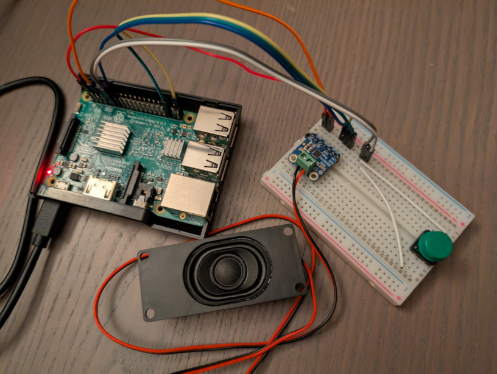

# lizard-button
An speaker controlled by an API and button.



# Hardware Setup

## Components

- Raspberry Pi (tested with 3B, 4B)
- MicroSD card (+4 GB)
- MAX98357A I2S 3W Class D amp breakout (pins soldered)
- Adafruit 3351 speaker (4 ohm, 3 watt, enclosed)
- 16mm tactile push button
- jumper wires

## Audio Wiring

| MAX98357A pin | Pi Pin               |
|---------------|----------------------|
| VIN           | 5V (physical pin 2)  |
| GND           | GND (physical pin 6) |
| BCLK          | GPIO18 (pin 12)      |
| LRC           | GPIO19 (pin 35)      |
| DIN           | GPIO21 (pin 40)      |

On the Adafruit 3351 speaker, cut off the JST-PH connector and strip the ends of the wires. Connect the wires to the amp's speaker output in any order.

The amp defaults to 9dB of gain, you can adjust this by wiring the amp's GAIN pin:
- GAIN -> VIN directly = 6dB
- No GAIN = 9dB (default)
- GAIN -> GND directly = 12dB
- GAIN -> GND through 100 ohm resistor = 15dB (max)

## Button Wiring

Wire the button legs to the Pi pins accordingly:
- GPIO17 (physical pin 11)
- GND (physical pin 9)

# Software Setup

## Operating System Setup

Use the [Raspberry Pi Imager](https://www.raspberrypi.com/software/) to load Raspberry Pi OS Lite (64-bit) on an SD card.

Configure the user, location, and network connection settings as prompted.

Once configured, boot into the system and clone this repository.

## Software Setup

Clone this repository to the Raspberry Pi.

Navigate to the repository contents and modify the configurations in the following files:
- API/button configurations: `config/device.env`
- API service: `config/lizard-api.service`
- button service: `config/lizard-button.service`

When satisfied, run `sudo bootstrap.sh` to install dependencies and apply configurations.

# Testing

## Button

Press the button - you should hear `lizard.wav` play over the speaker.

## API

Check status:  
```bash
curl http://RASPBERRY_PI_IP:5000/api/v1/status
```

Play a track:  
```bash
curl -X POST -H 'Content-Type: application/json' -H 'x-api-key: YOUR_API_KEY' -d '{"track_id":"lizard"}' http://RASPBERRY_PI_IP:5000/api/v1/play
```

# Troubleshooting

## No audio

Check if the Raspberry Pi is having power throttling issues:  
```bash
vcgencmd get_throttled
```

Any result other than `throttled=0x0` means you may have power throttling issues - confirm with a multimeter. If the voltage is lower than `4.75`, audio will not play.

&nbsp;
